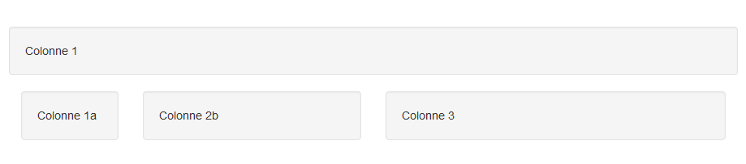

<!-- CSS titre -->
<style>
h1,h2,h3,h4 {
  color: steelblue; font-weight: bold;
}
</style>


```{r setup, include=FALSE}
knitr::opts_chunk$set(echo = TRUE, eval = FALSE)
```


# Introduction

`shiny` est un package développé par RStudio et disponible sur le CRAN. Il permet de créer des applications web interactives basées sur du code R, sans utiliser directement du HTML, CSS, JavaScript.

Pour installer `shiny` :

```{r}
install.packages("shiny")
```

Pour lancer un exemple d'application `shiny` :

```{r}
library("shiny")
runExample("01_hello")
```


# Structure d'une application

Une application est découpée en deux parties :

* un **ui** : pour user-interface, là où l'on définit l'apparence d'une application
* un **server** : là où l'on produit les sorties R que l'on veut inclure dans l'application

Toutes les applications shiny ont cette forme :


```{r}
library("shiny")
# User-interface
ui <- fluidPage(
  
)

# Server
server <- function(input, output) {
  
}

# Lancer l'application
shinyApp(ui = ui, server = server)
```


Le **ui** est définie par la fonction `fluidPage` dans laquelle nous allons pouvoir définir le layout (apparence) de l'application, pour cela on utilisera des fonctions R qui génère du code HTML.
<br>
Le **server** est définit comme étant une fonction prenant deux arguments obligatoires : `input` et `output`, ce sont ces éléments qui permettront la communication entre le **ui** et le **server**.


Ce script doit être sauvé dans un fichier `app.R` pour faire apparaître le bouton **Run App** de RStudio.

**Alternative : **Dans le cas d'applications complexes, il peut être intéressant de séparer le `ui` et le `server` dans deux scripts différents, respectivement `ui.R` et `server.R`.


# Interface de l'application


## Syntaxe

`fluidPage` est la fonction qui englobe tous les éléments de l'`ui`, on peut également utiliser `navbarPage` pour définir une barre de navigation et plusieurs onglets.

`shiny` dispose de nombreuses fonctions permettant d'agencer son interface proprement. Par exemple, ici on rajoute un titre, une barre latérale et un panneau central :

```{r}
library("shiny")
# User-interface
ui <- fluidPage(
  # Titre de l'application
  titlePanel(title = "Le titre de l'application"),
  
  # Layout avec un panneau latéral et un panneau central
  sidebarLayout(
    sidebarPanel = sidebarPanel(
      "En général on place ici les paramètres de l'application"
    ),
    mainPanel = mainPanel(
      "Et ici les sorties R"
    )
  )
)
```


</img>


## Layout avancé

### Bootstrap grid system

Il est possible d'utiliser le bootstrap grid system basé sur 12 colonnes qui s'adaptent en fonction de la largeur de l'écran.

Exmple de deux colonnes divisant la page en deux :

```{r}
fluidRow(
  column(
    width = 6,
    wellPanel("Colonne 1")
  ),
  column(
    width = 6,
    wellPanel("Colonne 2")
  )
)
```

</img>

Exemple de colonnes imbriquées :

```{r}
fluidRow(
  column(
    width = 12,
    wellPanel("Colonne 1"),
    column(
      width = 6,
      fluidRow(
        column(
          width = 4,
          wellPanel("Colonne 1a")
        ),
        column(
          width = 8,
          wellPanel("Colonne 2b")
        )
      )
    ),
    column(
      width = 6,
      wellPanel("Colonne 3")
    )
  )
)
```

</img>


### Navbar

Utilisation d'une navbar pour découper une application en plusieurs pages (onglets) :

```{r}
ui <- navbarPage(
  # Titre de l'application
  title = "Titre de l'application",
  
  # Première page
  tabPanel(
    title = "Page Un",
    "Eléments de la page Un"
  ),
  
  # Deuxième page
  tabPanel(
    title = "Page Deux",
    "Eléments de la page Deux"
  ),
  
  # Sous-menu avec d'autres pages
  navbarMenu(
    "Plus de pages",
    tabPanel(
      "Page trois",
      "Eléments de la page Trois"
    ),
    tabPanel(
      "Page quatre",
      "Eléments de la page Quatre"
    )
  )
  
)
```

</img>


## Inputs

Les **inputs** sont les paramètres de l&apos;application modifiables par l&apos;utilisateur. Ils sont définis à l&apos;intérieur de fonction permettant de construire des widgets, exemple avec la fonction `selectInput` permettant d&apos;afficher une liste déroulante dans l&apos;interface :

```{r, eval=FALSE}
# Menu déroulant
selectInput(
  inputId = "id_select", 
  label = "Ce qui s'affiche à l'écran",
  choices = c("A", "B", "C")
)

# Checkbox simple
checkboxInput(inputId = "id_checkbox", label = "Choix A", value = TRUE)
```

<!-- On peut accéder à la valeur prise par l&apos;input dans **server.R** en tapant : `input$id_select`. -->

La Widgets Gallery : http://shiny.rstudio.com/gallery/widget-gallery.html


On place deux widgets dans le panneau latéral :

```{r}
# User-interface
ui <- fluidPage(
  # Titre de l'application
  titlePanel(title = "Le titre de l'application"),
  
  # Layout avec un panneau latéral et un panneau central
  sidebarLayout(
    sidebarPanel = sidebarPanel(
      
      tags$h2("Paramètres"),
      selectInput(
        inputId = "loi", 
        label = "Choisissez une loi",
        choices = c("Normale", "Uniforme", "Exponentielle", "Poisson")
      ),
      sliderInput(
        inputId = "n",
        label = "Nombre d'observations",
        min = 10, max = 500, value = 50
      )
      
    ),
    mainPanel = mainPanel(
      "Et ici les sorties R"
    )
  )
)
```


</img>


## Outputs


Les **outputs** sont les sorties que l'on souhaite afficher dans l'interface, par exemple pour afficher un graphique on utilise `plotOutput`. Chaque type de sortie différente à sa fonction associée (`tableOutput` pour des tableaux, `verbatimTextOutput` pour afficher les résultats de la console...).

Pour placer un graphique dans l'interface il suffit donc de faire :

```{r}
# User-interface
ui <- fluidPage(
  # Titre de l'application
  titlePanel(title = "Le titre de l'application"),
  
  # Layout avec un panneau latéral et un panneau central
  sidebarLayout(
    sidebarPanel = sidebarPanel(
      
      tags$h2("Paramètres"),
      selectInput(
        inputId = "loi", 
        label = "Choisissez une loi",
        choices = c("Normale", "Uniforme", "Exponentielle", "Poisson")
      ),
      sliderInput(
        inputId = "n",
        label = "Nombre d'observations",
        min = 10, max = 500, value = 50
      )
      
    ),
    mainPanel = mainPanel(
      plotOutput(outputId = "graph")
    )
  )
)
```

</img>


Et maintenant il faut définir le code produisant le graphique, ces opérations sont faites dans le `server`.


# server


## Syntaxe

Le `server` est défini par une fonction prenant deux paramètres : `input` et `output`. `input` permet d'accèder aux valeurs prisent par les widgets définis dans l'`ui`. `output` permet de stocker les sorties R pour pouvoir les appeler dans l'`ui`.


```{r}
# Server
server <- function(input, output) {
  
}
```


## Outputs

Pour créer un output dans le `server` on utilise les fonctions de type `renderXXX`, par exemple pour créer un graphique :

```{r}
server <- function(input, output) {
  
  output$graph <- renderPlot({
    plot(1)
  })
  
}
```

On afficher ce graphique dans l'interface via `plotOutput(outputId = "graph")`

Les principales fonctions pour produire des sorties sont :

```{r, echo=FALSE, eval=TRUE, results='asis', warning=FALSE, message=FALSE}
# renderPlot # => un graphique
# renderTable # => un tableau
# renderPrint # => tout ce que le code R imprime dans la console
# renderText # => du texte
# renderUI # => du code HTML
# renderDataTable # => une DataTable
library(ReporteRsjars)
library(ReporteRs)
options('ReporteRs-fontsize'=14)
df = data.frame(V1 = c("renderPlot", "renderTable", "renderPrint", "renderText", "renderUI", "renderDataTable"),
                V2 = c("un graphique", "un tableau", "texte de la console", "du texte", "du code HTML", "une DataTable"),
                v3 = c("plotOuput", "tableOutput", "verbatimTextOutput", "verbatimTextOutput", "uiOutput", "dataTableOutput"), stringsAsFactors = FALSE)
names(df) = c("Fonction dans server.R", "Sortie", "Fonction dans ui.R")
dfft = FlexTable(df, header.text.props = textBold())
dfft[, , to = "header"] = parCenter()
dfft = setFlexTableWidths( dfft, widths = c(5,5,5) )
cat(as.html(dfft))
```


## Inputs

On peut utiliser les `inputs` définis par des widgets dans l'`ui` avec la notation `input$<id_input>`, dans notre exemple cela donne :

```{r}
server <- function(input, output) {
  
  output$graph <- renderPlot({
    # Choix de la loi en fonction de la valeur de input$loi
    fun <- switch(
      input$loi,
      "Normale" = rnorm, 
      "Uniforme" = runif, 
      "Exponentielle" = rexp, 
      "Poisson" = rpois
    )
    
    # On génére le input$n observations pour la loi choisie :
    dat <- data.frame(x = fun(n = input$n))
    # On calcule la moyenne cumulée
    dat$cummean <- cumsum(dat$x) / seq_along(dat$x)
    
    # Graphique de la moyenne cumulée
    ggplot(dat, aes(x = seq_along(x), y = cummean)) + 
      geom_line(lwd = 1.2, col = "steelblue")
  })
  
}
```


</img>


La fonction `renderPlot` est une fonction **réactive**, chaque fois qu'un paramètre dans l'expression change le code est réévalué. Les `input` ne peuvent être utulisés qu'uniquement dans des fonctions réactives.


## reactive()

Le code placé dans la fonction `renderPlot` est exécuté uniquement pour créer l'output `graph` et ne peut être utilisé ailleurs.

On apporte deux modifications à notre application : on ajoute un `textInput` pour que l'utilisateur puisse saisir le titre du graphique et on ajoute le résultat de `summary` sur la série des moyennes cumulées :


```{r}
# User-interface
ui <- fluidPage(
  # Titre de l'application
  titlePanel(title = "Le titre de l'application"),
  
  # Layout avec un panneau latéral et un panneau central
  sidebarLayout(
    sidebarPanel = sidebarPanel(
      
      tags$h4("Paramètres"),
      selectInput(
        inputId = "loi", 
        label = "Choisissez une loi",
        choices = c("Normale", "Uniforme", "Exponentielle", "Poisson")
      ),
      sliderInput(
        inputId = "n",
        label = "Nombre d'observations",
        min = 10, max = 500, value = 50
      ),
      textInput(inputId = "titre", label = "Titre du graphique", value = "Titre")
      
    ),
    mainPanel = mainPanel(
      plotOutput(outputId = "graph"), 
      verbatimTextOutput(outputId = "summary")
    )
  )
)

# Server
server <- function(input, output) {
  
  output$graph <- renderPlot({
    # Choix de la loi en fonction de la valeur de input$loi
    fun <- switch(
      input$loi,
      "Normale" = rnorm, 
      "Uniforme" = runif, 
      "Exponentielle" = rexp, 
      "Poisson" = rpois
    )
    
    # On génére le input$n observations pour la loi choisie :
    dat <- data.frame(x = fun(n = input$n))
    # On calcule la moyenne cumulée
    dat$cummean <- cumsum(dat$x) / seq_along(dat$x)
    
    # Graphique de la moyenne cumulée
    ggplot(dat, aes(x = seq_along(x), y = cummean)) +
      geom_line(lwd = 1.2, col = "steelblue") + 
      ggtitle(input$titre)
  })
  
  output$summary <- renderPrint({
    # Choix de la loi en fonction de la valeur de input$loi
    fun <- switch(
      input$loi,
      "Normale" = rnorm, 
      "Uniforme" = runif, 
      "Exponentielle" = rexp, 
      "Poisson" = rpois
    )
    
    # On génére le input$n observations pour la loi choisie :
    dat <- data.frame(x = fun(n = input$n))
    # On calcule la moyenne cumulée
    dat$cummean <- cumsum(dat$x) / seq_along(dat$x)
    
    # summary
    summary(dat$cummean)
  })
  
}

# Lancer l'application
shinyApp(ui = ui, server = server)
```

</img>


Il y deux problèmes avec ce code :

* on génére deux fois la série de chiffres aléatoires, ce qui fait que les deux sont indépendantes (celle utilisée pour le graphique n'est pas la même que celle utilisée pour le summary)
* lorsque l'on modifie le titre, cela regénére la série utilisée dans le graphique.


Pour régler ces problèmes, on utilise la fonction `reactive` qui permet de créer des objets réactifs utilisable dans les fonctions `render` :


```{r}
server <- function(input, output) {
  
  # Fonction reactive
  datReactive <- reactive({
    # Choix de la loi en fonction de la valeur de input$loi
    fun <- switch(
      input$loi,
      "Normale" = rnorm, 
      "Uniforme" = runif, 
      "Exponentielle" = rexp, 
      "Poisson" = rpois
    )
    
    # On génére le input$n observations pour la loi choisie :
    dat <- data.frame(x = fun(n = input$n))
    # On calcule la moyenne cumulée
    dat$cummean <- cumsum(dat$x) / seq_along(dat$x)
    return(dat)
  })
  
  
  output$graph <- renderPlot({
    # Graphique de la moyenne cumulée
    ggplot(datReactive(), aes(x = seq_along(x), y = cummean)) + 
      geom_line(lwd = 1.2, col = "steelblue") +
      ggtitle(input$titre)
  })
  
  output$summary <- renderPrint({
    # summary
    summary(datReactive()$cummean)
  })
  
}

```


Dans l'objet `datReactive` on définit un `data.frame` contenant la série de `input$n` chiffres générées par la loi choisie dans `input$loi`, l'objet est recréé chaque fois q'un de ces deux paramètres change.

On peut utiliser cet objet en l'appelant avec `datReactive()` dans les fonctions `render`.


## Exécution du code dans le server

Il y a 3 zones différentes où l'on peut placer du code R dans le `server`, en fonction de l'endroit où celui-ci est placé, il n'est pas exécuté au même moment et la même fréquence :


```{r}
# User-interface
ui <- fluidPage(
  actionButton(inputId = "bouton", label = "Clic !"),
  verbatimTextOutput(outputId = "test")
)

# Server
# Zone 1
zone1 <- sample(LETTERS, 1)

server <- function(input, output) {
  
  # Zone 2
  zone2 <- sample(LETTERS, 1)
  
  output$test <- renderPrint({
    input$bouton
    # Zone 3
    zone3 <- sample(LETTERS, 1)
    cat(
      "\n",
      "Zone 1 : ", zone1, "\n",
      "Zone 2 : ", zone2, "\n",
      "Zone 3 : ", zone3, "\n"
    )
  })
}

# App
shinyApp(ui = ui, server = server)
```

* **Zone 1** : le code est exécuté une fois au démarrage de l'application
* **Zone 2** : le code est exécuté chaque qu'un nouvel utilisateur se connecte à l'application
* **Zone 3** : pareil que pour la zone 2 mais peut-être réévalué plusieurs fois en fonction des actions de l'utilisateur.


# shinydashboard

Le package `shinydashboard` est une extension de `shiny` qui permet d'utiliser le template [AdminLTE Control Panel](https://almsaeedstudio.com/) pour construire des tableaux de bord.


Les principales différences avec shiny se situent dans l'`ui`, peu de changement dans le `server`, mis à part de nouvelles fonctions de type `renderX`.


Un exemple de dashboard :

```{r}
library("shinydashboard")

header <- dashboardHeader(title = "shinydashboard")

sidebar <- dashboardSidebar(
  sidebarMenu(
    menuItem("Dashboard", tabName = "dashboard", icon = icon("dashboard")),
    menuItem("Widgets", tabName = "widgets", icon = icon("th"))
  )
)

body <- dashboardBody(
  tabItems(
    tabItem("dashboard",
      div(p("Dashboard tab content"))
    ),
    tabItem("widgets",
      "Widgets tab content"
    )
  )
)

shinyApp(
  ui = dashboardPage(header, sidebar, body),
  server = function(input, output) { }
)
```


</img>


